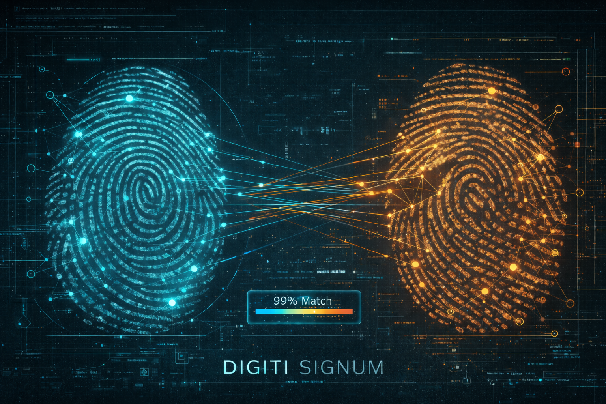

# Digiti Signum: Fingerprint Matching Analysis




An scientific research project demonstrating fingerprint matching and alteration detection using both traditional computer vision and deep learning approaches. This project explores how biometric systems work behind the scenes to match fingerprints and detect alterations.


<br><br>
<br><br>

## Overview

This project uses the [SOCOFing](https://www.kaggle.com/datasets/ruizgara/socofing) (Sokoto Coventry Fingerprint) dataset and includes three notebooks:

### Notebook 1: Exploratory Data Analysis (EDA)

- **Data Structure & Parsing** - Parsing filename metadata (subject_id, gender, hand, finger, alteration_type).

- **Class Distribution Analysis** - Real vs Altered, alteration types, difficulty levels.

- **Data Leakage Audit** - Critical analysis of train/test splits and subject overlap.

- **Baseline Comparison** - Model evaluation on original vs clean splits.

- **Grad-CAM Analysis** - Visualizing model attention and decision regions.

### Notebook 2: Traditional Computer Vision

- **SIFT feature extraction** - Identifying distinctive points in fingerprint images.

- **Basic matching algorithms** - Using FLANN and Lowe's ratio test.

- **RANSAC geometric verification** - Filtering false matches through geometric consistency.

- **Minutiae-based analysis** - Traditional forensic fingerprint identification.

### Notebook 3: Deep Learning

- **Custom 5-layer CNN** - Training a CNN from scratch for fingerprint classification.

- **Transfer Learning with ResNet18** - Leveraging pre-trained ImageNet features.

- **Multi-class classification** - Detecting 4 alteration types (Real, Central Rotation, Obliteration, Z-cut).


---

## Dataset

### The SOCOFing dataset contains:

- **6,000 real fingerprint images** from 600 subjects

- **49,270 altered fingerprints** with three difficulty levels:

  - Easy: Light modifications

  - Medium: Moderate modifications

  - Hard: Severe modifications

--- 

##  Dataset Attribution
This project uses the SOCOFing dataset provided for noncommercial not-for-profit research purposes. When using this dataset, you must cite:

> Shehu, Y.I., Ruiz-Garcia, A., Palade, V., James, A. (2018) "Detection of Fingerprint Alterations Using Deep Convolutional Neural Networks" in Proceedings of the International Conference on Artificial Neural Networks (ICANN 2018), Rhodes – Greece, 5th - 7th October 2018. Springer-Verlag Lecture Notes in Computer Science.

**Usage Terms:**
- This dataset is provided AS IS for **noncommercial not-for-profit research purposes only**.

- Any publications arising from the use of this software must cite the above work.

- This includes academic journal and conference publications, technical reports and manuals.

---

## Alteration Types

- **CR (Central Rotation)**: Portions of the fingerprint are rotated.

- **Obl (Obliteration)**: Parts of the fingerprint are erased or obscured.

- **Zcut**: Geometric cuts that remove sections of the print.


 Key Findings
This project demonstrates the progression from traditional computer vision to deep learning:
| Approach | Accuracy | Notes |
|----------|----------|-------|
| Basic SIFT | Wrong match | Produces false positives |
| SIFT + RANSAC | 35% score | Geometric verification |
| Minutiae k-NN | 92% | Traditional forensics |
| Custom CNN | 97.11% | Deep learning (5-layer), 100 epochs |
| ResNet18 (5 epochs) | 97.39% | Transfer learning, paper settings |
| ResNet18 (15 epochs) | 98.40% | Extended training, ~1% improvement |
| **Custom CNN (Optimized)** | **98.27%** | **Optimized training script** |
| **ResNet18 (Optimized)** | **99.47%** | **Optimized training script** |

---

## What we can draw from the notebooks

1. **Traditional CV has limitations** - SIFT alone can produce false positives; geometric verification (RANSAC) helps but is still insufficient.

2. **Minutiae-based approaches work well** - Traditional forensic methods achieve 92% accuracy using ridge endings and bifurcations.

3. **On this dataset and under the experimental settings used here, deep neural networks (our custom CNN and fine-tuned ResNet18) outperform the specific classical baselines we tested** - Custom CNN achieves 98.11%, while transfer learning with ResNet18 achieves 99.64%.

4. **Transfer learning is powerful** - Even with domain mismatch (ImageNet → fingerprints), fine-tuned ResNet18 outperforms custom CNNs.

5. **Both approaches have trade-offs** - Traditional methods demand less compute; deep learning has higher computational costs and benefits significantly from GPU acceleration, but achieves superior accuracy.

6. **Extended training can help** - Increasing ResNet18 from 5 to 15 epochs improves accuracy by ~1 percentage point (97.39% → 98.40%).

---

 ## Requirements

 For Notebook 2 (Traditional CV)
 ```
pip install opencv-contrib-python numpy matplotlib scikit-learn scikit-image tqdm
```
For Notebook 1 and 3 (Deep Learning)
```
pip install torch torchvision scikit-learn numpy matplotlib seaborn tqdm pillow pandas
```

You can also use the provided requirements.txt file:
```
pip install -r requirements.txt
```

---

## Notebooks

### Notebook 1: [EDA.ipynb](./notebooks/EDA.ipynb)

Exploratory data analysis:

1. Data Structure & Parsing

2. Class Distribution Analysis

3. Data Quality Checks

4. Data Leakage Audit

5. Baseline Model Comparison

6. Grad-CAM Visualization

7. Preprocessing Utilities

### Notebook 2: [digiti_signum.ipynb](./notebooks/digiti_signum.ipynb)

Traditional computer vision approach:

1. Setup and Data Protection

2. Dataset Exploration

3. Understanding SIFT

4. Basic Fingerprint Matching

5. Enhanced Matching with RANSAC

6. Minutiae-Based Analysis

7. Results Visualization

8. Interactive Exploration

9. Try Your Own

10. Summary and Key Takeaways

### Notebook 3: [detection_of_fingerprint_alterations_using_deep_convolutional_neural_networks.ipynb](./notebooks/detection_of_fingerprint_alterations_using_deep_convolutional_neural_networks.ipynb)

Deep learning approach:

1. Setup and Device Configuration

2. Dataset Preparation

3. Data Transforms and Augmentation

4. Create DataLoaders

5. Define Custom CNN Architecture

6. Define ResNet18 Model

7. Training Functions

8. Train and Compare Both Models

9. Model Evaluation

10. Confusion Matrix Analysis

11. Final Results Summary

12. Results Analysis & Educational Deep Dive

13. Interactive Testing

## Usage

1. Ensure the SOCOFing dataset is in `data/SOCOFing/`.

2. Each notebook will create a working copy in `data/SOCOFing_Working/` to protect the original data.

3. Run the notebook cells sequentially.

## Limitations

This is an educational demonstration, not a production biometric system:

- Results are from a single dataset (SOCOFing).

- Real-world fingerprint matching requires additional considerations.

- Security implications should be carefully evaluated.

- False positive/negative rates need comprehensive testing.

## References

### Primary Dataset

- [SOCOFing Dataset on Kaggle](https://www.kaggle.com/datasets/ruizgara/socofing)

- [SOCOFing Dataset Paper](https://arxiv.org/pdf/1807.10609) - Shehu, Y.I., et al. (2018). Sokoto Coventry Fingerprint Dataset.

### Research Papers

- [Detection of Fingerprint Alterations Using Deep CNN (Shehu et al., 2018)](https://irep.ntu.ac.uk/id/eprint/34736/1/12137_James.pdf) - *Required citation for SOCOFing dataset usage*.

- [SIFT Paper by David Lowe](https://www.cs.ubc.ca/~lowe/papers/ijcv04.pdf).

- [ResNet Paper (He et al., 2016)](https://arxiv.org/pdf/1512.03385).

### Documentation

- [OpenCV Documentation](https://docs.opencv.org/).
---

## License & Attribution

This project is licensed under the **Creative Commons Attribution 4.0 International (CC BY 4.0)** license.

You are free to **use, share, copy, modify, and redistribute** this material for any purpose (including commercial use), **provided that proper attribution is given**.

### Attribution requirements

Any reuse, redistribution, or derivative work **must** include:

1. **The creator's name**: `HelixCipher`

2. **A link to the original repository**:  

   https://github.com/HelixCipher/digiti-signum
3. **An indication of whether changes were made**

4. **A reference to the license (CC BY 4.0)**

#### Example Attribution

> This work is based on *Digiti Signum* by `HelixCipher`.  
> Original source: https://github.com/HelixCipher/digiti-signum

> Licensed under the Creative Commons Attribution 4.0 International (CC BY 4.0).

You may place this attribution in a README, documentation, credits section, or other visible location appropriate to the medium.

Full license text: https://creativecommons.org/licenses/by/4.0/

---

## Disclaimer

This project is provided "as—is". The author accepts no responsibility for how this material is used. There is **no warranty** or guarantee that the notebooks are safe, secure, or appropriate for any particular purpose. Use at your own risk.

See [DISCLAIMER.md](./DISCLAIMER.md) for full terms. Use at your own risk.

---

## Legal Compliance & Research Governance

This project, Digiti Signum, is conducted strictly for scientific research and educational purposes. To ensure alignment with European digital standards, the following frameworks apply:

1. EU AI Act Compliance

    - Research Exemption: This project falls under the Scientific Research Exception (Article 2(6)) of the EU AI Act. It is developed and used exclusively for R&D purposes and is not "placed on the market" or "put into service" for operational biometric identification.

    - Prohibited Practices Warranty: This repository does not implement or support prohibited AI practices, such as untargeted scraping of facial images, emotion recognition in workplaces, or social scoring.

    - Transparency: All results provided in the notebooks are for performance analysis between CV and Deep Learning and should not be used as a basis for real-world legal or forensic profiling.

2. GDPR & Data Privacy

    - Dataset Integrity: This project uses the SOCOFing dataset, which consists of synthetic/volunteer-provided data for research. No real-world, non-consensual personal data is processed or stored in this repository.

    - Data Minimization: Processing is limited to the features (minutiae/embeddings) necessary to demonstrate matching and alteration detection, in accordance with Article 89 of the GDPR (Safeguards for scientific research).

    - Local Processing: All computations are designed to be run locally; no biometric data is transmitted to third-party cloud services by the code provided here.